# 技术交底书

| 项目 | 内容 | 项目 | 内容 |
|------|------|------|------|
| 发明名称 | 一种基于高反空间证据与真实观测重提取的移动机器人反光标识识别方法和系统 | 申请类别 | 发明 |
| 全体申请人（按顺序） | 待填写 | 费用减缓备案号（统一社会信用代码） | 待填写 |
| 全体发明人（按顺序） | 待填写 | 第一发明人身份证号码 | 待填写 |
| 联系人 | 待填写 | 联系方式 | 待填写 |
| 申请人地址 | 待填写 | 代理机构名称、地址 | 待填写 |
| 代理人 | 待填写 | 代理人联系方式 | 待填写 |
| 申请文件确认，同意申报 | 权利要求书；说明书；说明书附图；请求书信息 | 申请途径 | 普通申请 |

## 发明名称

一种基于高反空间证据与真实观测重提取的移动机器人反光标识识别方法和系统

## 技术领域

本发明涉及移动机器人感知、激光雷达点云处理、反光标识识别和自动对接定位技术领域，尤其涉及一种在移动机器人运动过程中基于高反空间证据发现候选区域，并基于真实观测窗口重提取候选观测以完成指定反光标识识别的方法和系统。

## 背景技术

移动机器人在自动充电、工位停靠、物料交接、装卸对准、巡检回停等场景中，通常需要在接近目标端后完成较高精度的自动对接。为了降低视觉受光照影响、二维码遮挡、红外信号串扰以及单纯环境地图定位精度不足等问题，工程中常在充电桩、对接座、辅助定位板或工位端面上布置反光条、反光板或其它高反射标识，利用激光雷达接收到的高反射点实现目标定位。

现有技术中，常见方案包括以下几类。

（1）基于固定反光板的激光雷达定位。国家知识产权局公布公告系统公开的CN121454540A“一种基于双反光板的AGV定位方法及系统”中，AGV在预设反光板区域内切换至反光板定位模式，通过反射强度阈值提取高反点簇，并根据双反光板模型和反光板间几何关系计算车辆位姿。CN119644348A“一种基于反光板定位的局部导航方法”中，移动机器人进入反光板扫描区域后匹配反光板轮廓，计算筛选点云坐标，并经坐标变换得到反光板在移动机器人坐标系中的位姿矩阵。上述方案通常以预设反光板区域、固定反光板模型或当前帧轮廓匹配为基础，适合已知反光板布置场景。

来源链接：http://epub.cnipa.gov.cn/patent/CN121454540A  
来源链接：http://epub.cnipa.gov.cn/patent/CN119644348A

（2）基于反光板地图或栅格地图的定位。CN117490707A“基于栅格化反光板及环境信息的自动建图及定位算法”公开了构建栅格化反光板地图和环境地图，并据此实现物流装备定位的方案。该类方案的重点在于将反光板及环境信息作为定位地图使用，通常仍要求反光板特征和地图关系相对固定。

来源链接：http://epub.cnipa.gov.cn/patent/CN117490707A

（3）基于反光板快速匹配或组合定位。CN110031817A“一种激光雷达反光板的快速匹配方法”公开了根据上一帧定位是否成功选择动态匹配或静态匹配以提高反光板匹配速度。CN113625320A“一种基于差分GPS和反光板的室外组合定位方法”公开了将RTK差分GPS与反光板组合用于室外定位。上述方案主要关注反光板对象匹配效率或反光板与其它定位手段的组合。

来源链接：http://epub.cnipa.gov.cn/patent/CN110031817A  
来源链接：http://epub.cnipa.gov.cn/patent/CN113625320A

（4）面向机器人对接或充电的几何线段识别。CN112928799A“基于激光测量的移动机器人自动对接充电方法”公开了对充电桩周围激光数据进行断点检测、拐点检测和线段拟合，再根据充电桩长度、厚度以及充电桩与墙两边平行关系识别充电桩所在线段。CN114460927A“一种对接定位方法和移动机器人”公开了在第一精度地图和第二精度地图之间切换，并配合速度模式切换完成对接定位。上述方案多面向规则线段或多精度地图流程。

来源链接：http://epub.cnipa.gov.cn/patent/CN112928799A  
来源链接：http://epub.cnipa.gov.cn/patent/CN114460927A

（5）基于模板、先验区域或多级几何条件的识别。CN110824491A“充电桩定位方法”公开了对激光点云分割后筛选充电桩点云段，并与充电桩截面点云进行配准以确定充电桩位置。CN112327842B公开了利用充电桩世界坐标和机器人位姿限定搜索范围，再进行候选搜索、距离图搜索和刚体配准的方案。CN110221617A公开了利用强反射区、弱反射区、线段长度、间距和深度关系对充电桩或反光结构进行多级确认的方案。上述方案能够利用先验区域、模板或几何关系完成目标识别，但通常没有明确区分用于发现候选的地图证据域和用于保持既有识别输入契约的真实观测域，也未强调候选ROI只用于真实观测点簇关联而不直接成为识别输入。

来源链接：http://epub.cnipa.gov.cn/patent/CN110824491A  
来源链接：http://epub.cnipa.gov.cn/patent/CN112327842B  
来源链接：http://epub.cnipa.gov.cn/patent/CN110221617A

（6）高反射点云预处理。CN120233328A“激光雷达鬼影过滤方法、装置及电子设备”公开了基于反射率阈值标记高反射点云区域，再结合线束区域和距离关系识别并删除鬼影点云。该类方案关注高反射异常点过滤，并不以反光标识结构的在线候选生成、识别评分和自动对接输出为目标。

来源链接：http://epub.cnipa.gov.cn/patent/CN120233328A

上述现有技术已经公开了反光板强度阈值提取、反光板模型匹配、反光板地图定位、点云线段拟合以及对接流程控制等内容。但在实际移动机器人自动对接场景中，反光标识可能只在部分视角下可见，多个高反射干扰物可能同时存在，机器人运动过程中激光点云存在时间畸变和位姿误差，且深度学习或专用识别模型通常要求输入来自真实观测窗口而不是累计地图点。如果直接使用单帧阈值和几何规则，容易漏检或误检；如果直接把累计地图点、地图ROI裁剪点或反变换后的地图点送入识别模型，又可能破坏模型训练时的坐标、点密度、候选聚类和多帧窗口语义；如果异步识别过程缺少版本约束，则旧候选、旧评分或旧观测窗口可能被错误用于新地图，影响自动对接可靠性。

进一步地，在已有反光板定位和模板配准类方案中，地图或先验区域通常直接参与点云裁剪、模板搜索或几何配准。本发明关注的核心问题并非反光标识物理结构本身，而是：在稀疏、非重复扫描的三维激光点云条件下，如何利用地图域的累计证据稳定发现候选，同时避免地图融合结果改变既有识别模型或几何识别器所依赖的真实观测输入契约。

因此，需要一种能够在移动机器人运动过程中持续积累反光标识证据、从地图证据中生成候选区域、以候选ROI引导真实观测窗口中的候选簇重提取、并对候选、请求和评分进行版本一致性管理的反光标识识别方法和系统。

## 发明内容

### 本发明所要解决的技术问题

本发明所要解决的技术问题至少包括：

（1）如何在移动机器人运动过程中，将激光雷达高反射点、惯性测量数据和外部位姿数据转换为稳定、可更新且资源有界的高反空间证据地图。

（2）如何在利用地图发现候选反光标识区域的同时，仍保持识别模型输入来自真实观测窗口，避免累计地图点、地图ROI裁剪点或反变换地图点直接输入模型造成识别分布偏移。

（3）如何在候选提取、识别模型推理和决策输出异步运行时，保证候选快照、识别请求和评分结果之间版本一致，避免旧数据混用。

（4）如何在多个空间可分离的候选高反射区域并存、部分候选证据稀疏或计算资源受限时，以事件驱动方式触发识别，区分观测不足、无匹配簇、预算延迟和低评分拒识等状态，降低无效计算并提高对接目标选择可靠性。

### 本发明为解决上述技术问题采用以下技术方案

本发明提供一种基于高反空间证据与真实观测重提取的移动机器人反光标识识别方法，包括如下步骤。

S0，配置目标反光标识特征表示。所述目标反光标识特征表示可以为预训练识别模型对应的固定目标类别、预存模板点云、目标标识的几何参数、反射强度分布参数或其组合。优选地，第一实施方式采用预先配置的固定目标验证器输出单一匹配分数；运行时可替换模板或多类别输出作为可选实施方式。

S1，获取移动机器人上的激光雷达点云、惯性测量数据和外部位姿数据。所述外部位姿数据可以为激光惯性里程计、轮式里程计、多传感器融合定位或其它定位系统输出的位姿。

S2，从激光雷达点云中筛选高反射候选点。筛选条件包括反射强度不低于预设强度阈值、点到雷达距离处于预设距离范围内、点坐标有效，并记录每个高反射候选点的采样时刻或相对偏移时间。

S3，根据每个高反射候选点的采样时刻查询对应位姿，将该点从雷达坐标系变换到地图坐标系。优选地，系统对外部位姿的连续性进行检测，当位姿跳变超过预设速度或角速度门限时，开启新的地图周期，避免不同定位段的地图证据混合。

S4，对同一帧中的高反射候选点进行观测体素聚合，并将聚合后的观测融合到高反射证据地图中。所述高反射证据地图中的证据元素可记录位置均值、最大反射强度、支持帧数、累计证据量、空间均方根误差和最近更新时间。证据元素在满足最小支持帧数和最大均方根误差约束后，可被判定为成熟证据。

S5，生成地图域快照和观测域帧。地图域快照包括高反射证据点、证据强度、地图周期、当前雷达位姿等，用于候选结构提取。观测域帧包括已去畸变到统一参考时刻的真实高反射观测点、该帧雷达位姿、地图坐标包围盒、地图周期和截断标志，用于后续识别输入重构。

S6，从地图域快照中提取反光标识候选区域。具体地，将高反射证据点映射为细粒度体素和中尺度空间单元；根据证据强度和活跃体素数量筛选活跃中尺度单元；利用有限桥接规则将相邻或近邻活跃单元组成种子区域；对种子区域进行ROI扩张并收集ROI内的高反射证据点；基于ROI重叠、点集重叠和空间跨度进行去重，得到一个或多个空间可分离的反光标识候选区域。若两个真实反光标识的高反支持区域距离过近、ROI明显重叠或被同一ROI同时收纳，则系统可输出退化状态或等待更多观测，而不将其静默作为普通负样本处理。

S7，为每个候选分配候选编号、候选快照编号和候选支持版本。候选支持版本优选地在候选支持点数量、累计证据量、支持集合或包围盒发生实质变化时递增；仅同一批已饱和证据再次被观测到时，不单独触发版本递增。

S8，根据事件触发条件生成识别请求。所述事件触发条件包括新候选出现、候选由不可识别变为可识别、活动目标消失、候选证据发生实质增长、上一次识别由于观测不足或预算延迟而可重试等。候选是否可进入识别可根据地图支持证据量、候选ROI尺寸、估计有效点数、可用观测窗口数量或其组合判断，而不要求以地图候选消息中的实际点云字段作为识别输入。识别请求携带请求编号、地图周期、候选快照编号、候选编号和候选支持版本。

S9，基于候选ROI从短时观测环中重构候选观测窗口。短时观测环保存多个观测域帧。系统先根据地图周期、截断标志和帧包围盒筛选可能相关的连续观测帧，再在完整真实观测窗口中执行候选点簇提取或复用既有候选提取流程，并利用候选ROI从这些真实观测点簇中选择与地图候选对应的候选簇。候选ROI用于关联和选择候选簇，而不是将地图融合点或简单ROI裁剪点直接作为识别输入。选中的点簇转换到窗口参考雷达坐标系，并按照目标验证模型的点数、强度、掩码和元信息规则构造模型输入。

S10，将构造的模型输入与目标反光标识特征表示进行比较，得到候选评分。所述比较可以通过点云神经网络、固定目标验证器、多类别分类器、模板匹配模型、BPU部署模型、几何评分器或其组合完成。几何评分器可以根据反光标识的条数、间距、宽度、角度、平面度和强度分布计算相似度。

S11，对评分结果进行版本一致性校验。决策模块仅接受地图周期、请求编号、候选快照编号、候选编号和候选支持版本均与当前等待请求一致的评分结果。

S12，根据评分阈值、最佳候选与次佳候选评分间隔、最少有效候选数量等条件选择活动目标。若候选处于观测不足、有效点不足、无匹配点簇、预算延迟或超时状态，则不将该状态等同于非目标低评分；若有效评分候选不足或最佳候选优势不足，则维持搜索状态或等待候选证据增长后重新识别。

S13，输出活动目标的候选区域、候选编号、目标状态和高反支持区域位置。可选地，对活动目标的地图支持点进行几何位姿估计，得到高反支持区域中心、平面法向、主方向或目标姿态，并输出给自动对接控制器或上层定位模块。若平面误差、支持点数量、中心跳变或法向跳变不满足约束，则输出无效几何状态，不执行强制对接。

本发明还提供一种用于实施上述方法的系统，包括传感与位姿源、高反射动态建图模块、反光标识候选提取模块、观测重提取与目标评分模块、决策与对接输出模块。

传感与位姿源用于提供激光雷达点云、惯性测量数据和外部位姿数据。

高反射动态建图模块用于执行高反射点筛选、逐点时间位姿查询、点云去畸变、单帧观测聚合、跨帧证据融合，并输出地图域快照和观测域帧。

反光标识候选提取模块用于基于地图域快照进行中尺度单元聚合、种子区域桥接、ROI补全、候选去重和候选版本管理。

观测重提取与目标评分模块用于维护短时观测环，在真实观测窗口内提取候选点簇，按候选ROI选择与地图候选对应的点簇，并调用目标验证模型、模板匹配器或几何评分器得到候选评分。

决策与对接输出模块用于生成识别请求、校验评分版本、区分无效观测状态和低评分拒识状态、选择活动目标，并输出候选区域、目标状态以及可选的几何位姿。

### 本发明采用以上技术方案与现有技术相比，具有以下技术效果

（1）通过移动过程中的高反射证据地图，本发明能够对部分遮挡、单帧稀疏或短时噪声下的反光标识进行多帧空间证据累计，提高候选发现的稳定性。

（2）通过地图域和观测域分离，本发明既利用累计地图发现候选区域，又保持识别模型输入来自真实观测窗口及其候选点簇，降低累计地图点、地图ROI裁剪点或反变换地图点对模型输入分布造成的影响。

（3）通过地图周期、候选快照编号、候选支持版本、识别请求编号和评分结果版本的联合校验，本发明能够避免异步系统中旧候选或旧评分被错误使用。

（4）通过事件驱动识别触发，本发明减少每帧全量识别造成的计算浪费，并可在候选证据发生实质变化、活动目标消失、观测不足可重试或预算延迟解除时及时重试。

（5）本发明不限定反光标识必须为两个反光板或规则线段，可适用于具有预设目标特征表示的反光条组合、反光板阵列、高反射贴片图案、带角度或间距关系的反光结构等多种对接目标；对于高反支持区域空间可分离的多个候选，可分别构建候选观测并进行目标一致性判断。

（6）本发明输出候选区域、目标状态、高反支持区域位置以及可选的几何姿态，能够为移动机器人自动对接控制器或上层定位模块提供可诊断的目标输入，避免在几何条件不足时强行输出不可靠位姿。

### 技术关键点和欲保护点

（1）保护高反空间证据域用于发现和维护候选区域、真实观测域用于保持识别输入契约的双域反光标识识别方法。

（2）保护基于逐点时间位姿查询和高反射证据融合的反光标识动态建图方法。

（3）保护地图候选ROI仅用于在真实观测窗口候选簇中进行关联选择，而不直接将地图融合点或简单ROI裁剪点作为识别输入的观测重提取方法。

（4）保护基于细粒度体素、中尺度单元、有限桥接和ROI补全的反光标识候选生成方法，以及空间可分离候选的身份维护方法。

（5）保护候选快照、候选支持版本、识别请求和评分结果之间的版本一致性校验机制。

（6）保护基于候选证据变化、观测不足、无匹配点簇、预算延迟、低评分拒识等状态区分的事件驱动识别触发与重试机制。

（7）保护基于候选地图支持点输出高反支持区域位置及可选几何位姿，并对位姿有效性进行判定的方法。

## 附图说明

图1是本发明基于高反空间证据与真实观测重提取的反光标识识别系统框图。

图2是本发明反光标识识别方法的软件流程图。

## 具体实施方式

下面结合附图对本发明的技术方案做进一步的详细说明。应当理解，以下实施例用于说明本发明而不用于限定本发明保护范围。对于本技术领域的普通技术人员而言，在不脱离本发明原理的前提下，还可以对传感器类型、反光标识结构形式、识别模型类型、参数阈值和对接控制方式作出改进或替换，这些改进或替换均应视为本发明的保护范围。

### 一、硬件装置和系统结构

如图1所示，本发明系统可以部署在移动机器人本体或机器人控制器中。移动机器人上设置有激光雷达、惯性测量单元、计算单元和通信接口。激光雷达用于采集目标区域内的点云数据，优选地能够输出每个点的反射强度和点内相对采样时间。惯性测量单元用于提供角速度和加速度。计算单元用于执行高反射动态建图、候选提取、观测重提取、识别评分和目标决策。通信接口用于接收外部位姿数据并向对接控制器输出候选区域、目标状态以及可选的几何位姿。

目标对接端设置有反光标识。所述反光标识可以安装于充电桩、对接座、仓储工位、物流接口、门架或辅助定位板上。反光标识可以包括一条或多条反光条、反光板、反光贴片、反光阵列或其组合。不同反光单元之间可以具有预设间距、长度、宽度、夹角、平面关系或强度分布，从而形成可被识别的目标特征表示。

图1对应的系统框图如下。

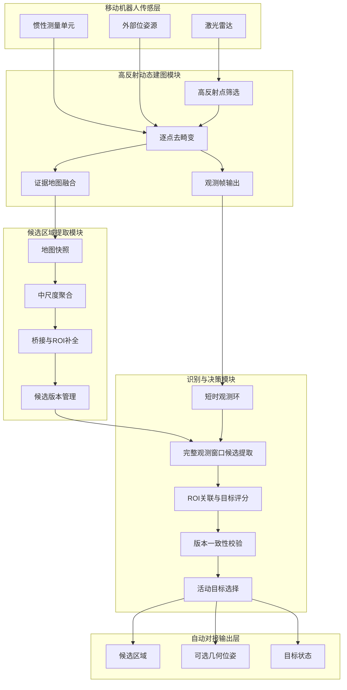
<!--  -->

### 二、软件方法

如图2所示，本发明的软件流程包括传感输入、高反射点筛选、逐点去畸变、证据地图更新、候选区域提取、识别请求触发、真实观测窗口候选提取、ROI关联、目标评分、版本一致性校验和目标状态输出。

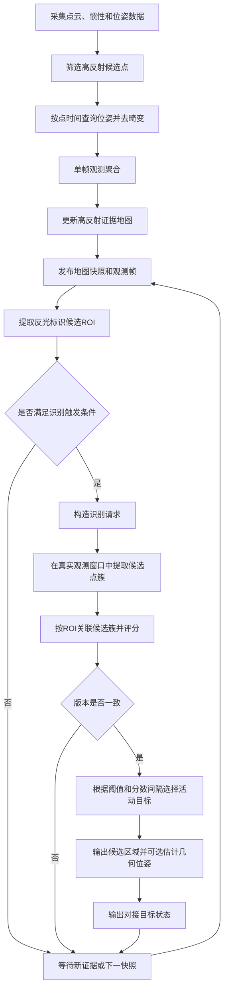
<!-- 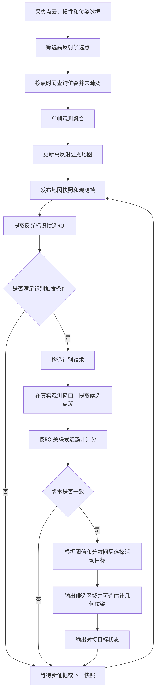 -->

#### 符号与变量说明

下表给出本实施方式中主要符号与变量的含义。各阈值均可根据雷达型号、反光标识尺寸、安装距离和现场验证结果进行标定。

| 符号 | 含义 |
|------|------|
| \(i\)<!--  --> | 点云中点的索引 |
| \(k\)<!--  --> | 观测帧索引 |
| \(c\)<!--  --> | 候选反光标识区域索引 |
| \(q\)<!--  --> | 候选观测窗口索引 |
| \(\mathbf{p}^{L}_{i}\)<!-- 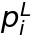 --> | 第 \(i\)<!--  --> 个点在雷达坐标系下的位置 |
| \(\mathbf{p}^{M}_{i}\)<!-- 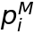 --> | 第 \(i\)<!--  --> 个点在地图坐标系下的位置 |
| \(r_i\)<!-- 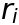 --> | 第 \(i\)<!--  --> 个点的反射强度 |
| \(t_i\)<!--  --> | 第 \(i\)<!-- 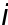 --> 个点的采样时间或相对时间 |
| \(\mathbf{T}^{M}_{L}(t_i)\) | 时刻 \(t_i\)<!--  --> 从雷达坐标系到地图坐标系的位姿变换 |
| \(\theta_r\)<!--  --> | 高反射强度阈值 |
| \(d_{\min}, d_{\max}\)<!--  --> | 点到雷达的有效距离下限和上限 |
| \(\mathcal{H}_k\)<!-- 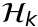 --> | 第 \(k\)<!--  --> 帧中的高反射候选点集合 |
| \(m\)<!--  --> | 高反射证据地图中的证据元素索引 |
| \(\boldsymbol{\mu}_m\)<!--  --> | 证据元素 \(m\)<!-- 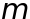 --> 的位置均值 |
| \(\mathbf{z}_m\)<!-- 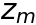 --> | 写入证据元素 \(m\)<!--  --> 的本次观测位置 |
| \(w_m, w_{\max}\)<!-- 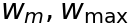 --> | 证据元素当前融合权重及其上限 |
| \(\alpha_m\)<!-- 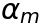 --> | 证据元素位置更新系数 |
| \(n_m\)<!-- 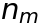 --> | 支持证据元素 \(m\)<!--  --> 的观测帧数 |
| \(\rho_m\)<!--  --> | 证据元素 \(m\)<!--  --> 的空间均方根误差 |
| \(\theta_n, \theta_{\rho}\)<!-- 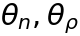 --> | 成熟支持帧数阈值和成熟误差阈值 |
| \(R_c\)<!--  --> | 候选 \(c\)<!--  --> 的地图域ROI |
| \(E_c\)<!-- 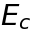 --> | 候选 \(c\)<!--  --> 的累计证据量 |
| \(e_m, e_{\max}\)<!-- 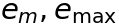 --> | 证据元素累计证据量及其饱和值 |
| \(u_c\)<!--  --> | 候选 \(c\)<!--  --> 的支持版本 |
| \(\Delta v_c, \Delta E_c, \Delta b_c\)<!-- 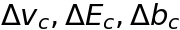 --> | 候选新增支持点数量、累计证据增长量和包围盒扩张量 |
| \(\theta_v, \theta_E, \theta_b\)<!-- 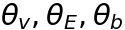 --> | 支持版本递增对应阈值 |
| \(W_{c,q}\)<!-- 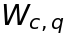 --> | 候选 \(c\)<!--  --> 的第 \(q\)<!-- 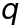 --> 个真实观测窗口 |
| \(P_{c,q}\)<!-- 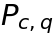 --> | 由候选ROI在真实观测窗口中关联得到的候选点簇 |
| \(s_{c,q}\)<!--  --> | 候选 \(c\)<!-- 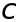 --> 在窗口 \(q\)<!--  --> 中的识别评分 |
| \(S_c\)<!--  --> | 候选 \(c\)<!--  --> 的综合评分 |
| \(c^\star\)<!-- 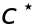 --> | 被选中的活动候选 |
| \(\theta_s, \theta_{\Delta}\)<!-- 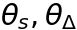 --> | 活动目标评分阈值和最佳/次佳评分间隔阈值 |

#### 1. 高反射点筛选和逐点去畸变

系统对每一帧激光雷达点云中的点进行遍历。对于第 \(i\)<!--  --> 个点，若其反射强度 \(r_i\)<!--  --> 不小于阈值 \(\theta_r\)<!-- 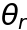 -->，其距离位于 \([d_{\min}, d_{\max}]\)<!-- 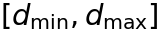 --> 内，且点坐标有效，则将其作为高反射候选点。该筛选过程可表示为：

\[
\mathcal{H}_k=\left\{i\mid r_i\geq \theta_r,\ d_{\min}\leq \left\|\mathbf{p}^{L}_{i}\right\|_2\leq d_{\max},\ \mathbf{p}^{L}_{i}\ \mathrm{有效}\right\} \tag{1}
\]
<!-- 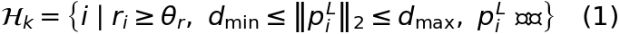 -->

其中，\(k\)<!-- 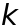 --> 为观测帧索引，\(\mathbf{p}^{L}_{i}\)<!--  --> 表示第 \(i\)<!--  --> 个点在雷达坐标系下的位置。系统根据点的采样时间 \(t_i\)<!-- 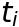 --> 查询位姿变换 \(\mathbf{T}^{M}_{L}(t_i)\)，将该点转换至地图坐标系：

\[
\mathbf{p}^{M}_{i}=\mathbf{T}^{M}_{L}(t_i)\mathbf{p}^{L}_{i} \tag{2}
\]
<!-- 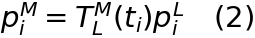 -->

这种按点时间查询位姿的方式能够减少移动机器人运动过程中点云时间畸变对高反空间证据地图的影响。

#### 2. 高反射证据地图更新

为避免同一帧内大量相邻点重复影响地图，系统先按观测体素对同一帧高反射点进行聚合。聚合观测写入高反射证据地图后，对地图证据元素 \(m\)<!--  --> 的位置均值 \(\boldsymbol{\mu}_m\)<!-- 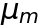 --> 进行有界权重更新：

\[
\boldsymbol{\mu}_m^{+}=\boldsymbol{\mu}_m+\alpha_m\left(\mathbf{z}_m-\boldsymbol{\mu}_m\right),\quad \alpha_m=\frac{1}{\min(w_m+1,w_{\max})} \tag{3}
\]
<!-- 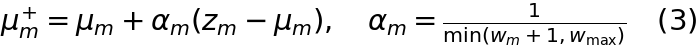 -->

其中，\(\mathbf{z}_m\)<!--  --> 为本次观测位置，\(w_m\)<!-- 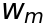 --> 为当前融合权重，\(w_{\max}\)<!-- 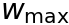 --> 为权重上限。证据元素满足下式时可作为成熟证据：

\[
n_m\geq \theta_n,\quad \rho_m\leq \theta_{\rho} \tag{4}
\]
<!-- 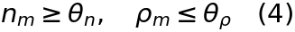 -->

其中，\(n_m\)<!--  --> 为支持该证据元素的观测帧数，\(\rho_m\)<!-- 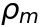 --> 为空间均方根误差，\(\theta_n\)<!-- 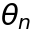 --> 为最小支持帧数，\(\theta_{\rho}\)<!--  --> 为最大均方根误差阈值。

#### 3. 候选反光标识区域提取

候选提取模块读取不可变地图快照，将高反射证据点映射到中尺度空间单元。若某中尺度单元中的累计证据量和活跃细粒度体素数量满足阈值，则该单元被判定为活跃单元。活跃单元之间通过有限桥接规则形成种子区域。种子区域的空间包围盒向外扩张预设距离形成候选ROI \(R_c\)<!--  -->，并收集 \(R_c\)<!--  --> 内的证据元素形成候选支持集。

候选 \(c\)<!--  --> 的累计证据量可以表示为：

\[
E_c=\sum_{m:\boldsymbol{\mu}_m\in R_c}\min(e_m,e_{\max}) \tag{5}
\]
<!-- 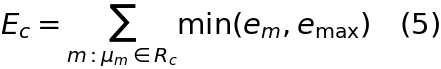 -->

其中，\(e_m\)<!-- 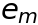 --> 为证据元素 \(m\)<!--  --> 的累计证据量，\(e_{\max}\)<!-- 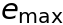 --> 为单个证据元素的证据饱和值。系统根据候选支持点数量、累计证据量、空间跨度和候选ROI重叠情况对候选进行过滤和去重。对于高反支持区域空间可分离的多个候选，系统分别维护候选编号和候选ROI；对于近距离双板、ROI明显重叠或同一ROI同时覆盖多个真实标识的情形，系统可输出退化状态、等待更多观测或转交上层策略处理。

#### 4. 候选版本和识别请求

每个候选携带地图周期、候选快照编号、候选编号和候选支持版本。候选支持版本 \(u_c\)<!-- 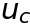 --> 在候选新增支持点、累计证据有效增长或包围盒发生显著扩张时递增：

\[
u_c^{+}=u_c+1,\quad \mathrm{if}\ \Delta v_c\geq \theta_v\ \mathrm{or}\ \Delta E_c\geq \theta_E\ \mathrm{or}\ \Delta b_c\geq \theta_b \tag{6}
\]
<!-- 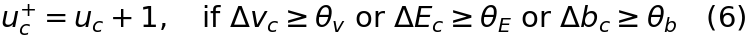 -->

其中，\(\Delta v_c\)<!-- 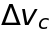 --> 表示新增支持点数量，\(\Delta E_c\)<!-- 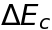 --> 表示累计证据有效增长量，\(\Delta b_c\)<!-- 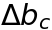 --> 表示包围盒扩张量，\(\theta_v,\theta_E,\theta_b\)<!--  --> 为对应阈值。若仅为同一批已饱和证据再次被观测到，则优选地不递增候选支持版本。

识别请求中携带请求编号、地图周期、候选快照编号、候选编号和候选支持版本。识别模块和决策模块均根据这些字段判断请求和评分是否对应同一候选快照。

#### 5. 真实观测重提取和目标评分

观测重提取模块维护短时观测环。每个观测帧保存参考雷达坐标系下的真实高反射点、该帧雷达在地图坐标系中的位姿、该帧点云在地图坐标系中的包围盒和地图周期。对于候选 \(c\)<!--  -->，系统用其ROI \(R_c\)<!--  --> 查找连续观测帧，构造候选观测窗口 \(W_{c,q}\)<!--  -->。在每个候选观测窗口中，系统先基于真实观测点执行候选点簇提取，再利用 \(R_c\)<!-- 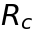 --> 从所得点簇集合中选择与地图候选对应的点簇 \(P_{c,q}\)<!--  --> 作为识别输入。

上述过程使候选ROI成为观测点簇的关联约束，而不是识别输入本身。换言之，识别模型或评分器接收的是与真实观测窗口候选提取流程一致的点簇，而非累计地图点、地图ROI裁剪点或由地图点反变换得到的点集。

目标验证模型或评分器对 \(P_{c,q}\)<!--  --> 与目标反光标识特征表示的一致性输出评分 \(s_{c,q}\)<!-- 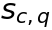 -->。当第一实施方式只使用一个高质量窗口时，\(q\)<!--  --> 可以只取一个值；当存在多个可用窗口时，可以取最高分或中位数作为候选评分，例如：

\[
S_c=\max_{q:W_{c,q}\ \mathrm{可用}} s_{c,q} \tag{7}
\]
<!-- 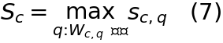 -->

在其它实施例中，也可以采用中位数、加权平均、投票或几何评分与模型评分融合的方式得到 \(S_c\)<!--  -->。若候选没有可用窗口、有效点数不足、真实观测窗口中不存在可关联点簇或计算预算暂不可用，则识别模块输出相应无效状态，并将 \(S_c\)<!-- 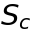 --> 标记为不可用于目标选择。

#### 6. 活动目标选择和输出

决策模块首先校验评分结果的地图周期、请求编号、候选快照编号、候选编号和候选支持版本是否一致。版本一致后，按如下条件选择活动目标：

\[
c^\star=\arg\max_{c} S_c,\quad S_{c^\star}>\theta_s,\quad S_{c^\star}-\max_{c\neq c^\star}S_c\geq \theta_{\Delta} \tag{8}
\]
<!-- 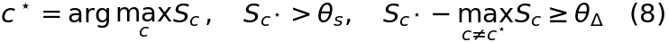 -->

其中，\(c^\star\)<!--  --> 为被选中的候选，\(\theta_s\)<!--  --> 为评分阈值，\(\theta_{\Delta}\)<!--  --> 为最佳候选与次佳候选的最小评分间隔。若有效评分候选数量不足，或式 (8) 不满足，则系统不输出新的活动目标。处于观测不足、无匹配点簇、预算延迟或超时状态的候选不参与式 (8) 的有效评分排序。

活动目标确认后，系统至少输出候选编号、候选ROI、高反支持区域中心和目标状态。可选地，系统对其地图支持点进行平面拟合，得到高反支持区域中心、法向和主方向，并根据平面均方根误差、点数、中心跳变和法向跳变等条件判断位姿是否有效。有效时，系统向自动对接控制器或上层定位模块输出可用几何位姿；无效时，输出无效几何状态或继续搜索。

#### 7. 关键参数示例

| 参数名称 | 符号 | 含义 | 示例或取值范围 |
|----------|------|------|----------------|
| 高反射强度阈值 | \(\theta_r\)<!--  --> | 判定点是否属于高反射候选点的强度门限 | 按雷达强度范围标定，例如160或其它值 |
| 有效距离范围 | \(d_{\min}, d_{\max}\)<!--  --> | 过滤过近或过远点 | 例如0.1 m至15 m |
| 成熟支持帧数 | \(\theta_n\)<!--  --> | 证据元素成为成熟证据所需最小帧数 | 2帧以上，优选3帧以上 |
| 成熟误差阈值 | \(\theta_{\rho}\)<!--  --> | 证据元素允许的最大空间均方根误差 | 厘米级 |
| 候选新增点数阈值 | \(\theta_v\)<!--  --> | 支持版本递增所需新增支持点数 | 正整数 |
| 候选证据增长阈值 | \(\theta_E\)<!--  --> | 支持版本递增所需累计证据增长量 | 正整数 |
| 候选包围盒扩张阈值 | \(\theta_b\)<!--  --> | 支持版本递增所需包围盒扩张量 | 米 |
| 评分阈值 | \(\theta_s\)<!--  --> | 活动目标最低有效评分 | 由模型或现场标定确定 |
| 评分间隔阈值 | \(\theta_{\Delta}\)<!--  --> | 最佳候选与次佳候选最小评分差 | 由验证集或现场测试确定 |
| 最小有效观测窗口数 | - | 候选进入评分所需真实观测窗口数量 | 第一实施方式可取1，多窗口聚合可取2以上 |
| 最小有效点数 | - | 真实观测窗口候选点簇进入评分所需点数 | 由雷达线数、距离和标识尺寸标定 |

### 三、实施例和变形方式

在一个具体实施例中，移动机器人搭载三维激光雷达和惯性测量单元，并接收外部激光惯性里程计输出的位姿。目标对接座上设置若干条反光贴，系统预先配置与该目标反光贴组合对应的目标特征表示。机器人接近目标区域后，系统从三维激光雷达点云中筛选反射强度超过阈值的点，并按每个点的采样时间查询位姿，将点转换到局部地图坐标系。系统将同一帧内邻近高反射点聚合为观测，再跨帧融合为高反射证据元素。

候选提取模块周期性读取地图快照，将证据点聚合为中尺度单元，利用有限桥接和ROI补全得到若干候选反光标识区域。对于满足支持证据、ROI尺寸或观测可用性要求的候选，决策模块发布识别请求。识别模块从短时观测环中查找与候选ROI相交的连续观测帧，在完整真实观测窗口中执行候选点簇提取，并选择与候选ROI重叠度较高、中心距离较近或质量评分较好的点簇送入目标验证模型。模型输出候选评分后，决策模块校验版本字段，并选择评分最高且满足阈值和分数间隔条件的候选作为活动目标。系统输出活动候选的ROI、高反支持区域中心和目标状态；在几何条件满足时，可进一步拟合活动候选的中心和法向，输出给机器人对接控制器。

在另一实施例中，目标验证模型可以替换为几何评分器。几何评分器根据反光标识的条数、长度、宽度、间距、夹角、平面度和强度分布计算结构相似度。此时，观测重提取和版本一致性校验仍保持不变。

在又一实施例中，外部位姿数据可以来自轮式里程计、视觉惯性里程计、二维码定位、UWB定位或多传感器融合定位。只要能够为高反射点提供时间对应的位姿变换，即可实施本发明。

在效果验证实施例中，可以采用如下对比方式验证本发明的技术效果：第一组为不使用地图的既有真实观测窗口识别流程；第二组为直接将高反证据地图点或地图ROI点作为识别输入的流程；第三组为本发明的地图引导真实观测重提取流程，即在完整真实观测窗口中提取候选点簇后再由地图候选ROI进行关联选择；第四组为仅使用最近单帧或直接ROI裁剪点的流程。可比较的指标包括候选召回率、与既有真实观测窗口流程所选点簇的一致率、目标存在场景下的识别率、目标不存在或非目标反光标识场景下的误选率、识别评分差异分布、CPU占用、内存占用和识别模型调用次数。该验证方式用于证明地图域候选发现与观测域输入保持之间的技术效果，而非单纯证明高反点能够被阈值检测。

以上所述仅是本发明的部分实施方式，应当指出，对于本技术领域的普通技术人员来说，在不脱离本发明原理的前提下，还可以做出若干改进和润饰，这些改进和润饰也应视为本发明的保护范围。

## 图1

见“基于高反空间证据与真实观测重提取的反光标识识别系统框图”。

## 图2

见“反光标识识别方法的软件流程图”。
